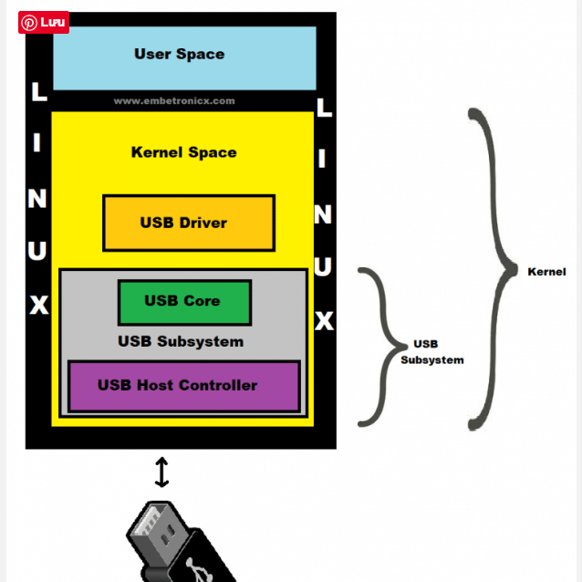
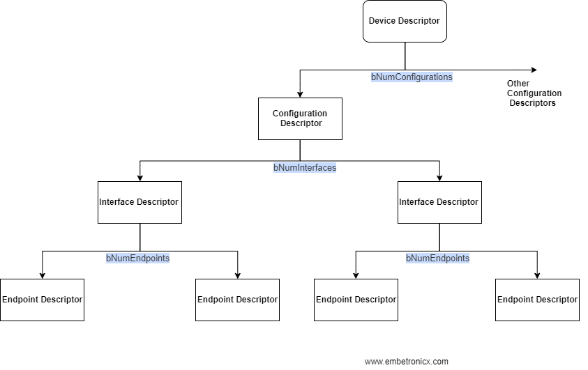

# USB_DEVICE
The usb system consits of USB core, USB host controller, USB host controller's driver

1. USB device
2. USB host controller
This is used to communications between host system and USB device. USB host controller contain both of hardware and software:
- Hardware:
    - Detect connet/disconnect USB device.
    - Providing power to connect USB device
- Software:
    - Call USB host controller driver, load USB device driver, manage data transfer.
    - Assign the appropriate USB device driver to the device.  
        + Open host controller interface (OHCI) USB 1.X
        + Universal host controller interface (UHCI) USB 1.X
        + Enhanced host controller interface (EHCI) USB 2.X
        + Extend host controller interface (XHCI) USB 3.X

3. USB core
Usb core is a  codebase consisting of rountine and struct available to host controller driver and usb driver.  
4. USB driver
Driver which write for USB device.  
5. USB descriptor
The USB device contains of a number of descriptor that help to define what the device is capable of. 

- Device descriptor:
    + USB device only have 1 device descriptor. Device descriptor include information revision USB, product, vendor id  

- Configuration descriptor:  
    + The configuration descriptor specifies values such as the amount of power this particular configuration uses if the device is self or bus-powered and the number of interfaces it has. 
    + When a device is enumerated, the host reads the device descriptors and can make a decision of which configuration to enable. 
    + A device can have more than one configuration, though it can enable only one configuration at a time.
- Interface descriptor: 
    + A device can have one or more interfaces. Each interface can have a number of endpoint and represents a function 
- Endpoint descriptor:
    + Each endpoint descriptor is used to specify the type of transfer, direction, polling interval, and maximum packet size for each endpoint

